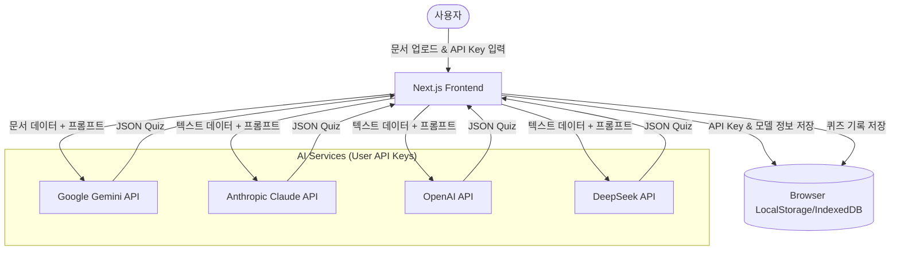

# Architecture Design: Document Analysis & Quiz Generator

## 1. Overview
사용자 중심의 비용 최적화(Free-tier)를 목표로 하며, 로컬 브라우저 자원과 LLM의 API 기능을 최대한 활용하는 서버리스 성격의 아키텍처입니다.

## 2. Component Diagram


## 3. Data Flow
1. **API Key 설정**: 사용자가 설정 페이지에서 각 LLM 서비스의 API Key를 입력하면 브라우저의 전용 저장소에 암호화하여 보관(혹은 세션 동안만 유지)합니다.
2. **문서 전처리**:
   - **Gemini 선택 시**: PDF/이미지를 직접 API로 전송 (Gemini는 자체 OCR 기능이 우수하며 무료 티어에서도 문서 처리가 강력함).
   - **타 모델 선택 시**: 브라우저 단에서 `pdf-dist` 등을 이용해 텍스트를 추출한 뒤 텍스트 형태로 전송.
3. **문제 생성 (Prompt Engineering)**:
   - 사용자가 선택한 유형(수능형, 객관식, 단답형)과 갯수를 조합하여 JSON 스키마를 따르도록 시스템 프롬프트를 구성합니다.
4. **결과 렌더링**: 생성된 JSON 데이터를 파싱하여 학생용 문제 풀이 UI로 변환합니다.

## 4. Key Strategies for "Free-tier" & "User API"
- **Gemini First Strategy**: Google Gemini 1.5 Flash는 문서 인식 능력이 뛰어나고 비용 효율적(무료 등급 제공)이므로 기본 엔진으로 권장합니다.
- **No Backend DB**: 사용자의 데이터는 서버에 저장하지 않고 IndexedDB를 활용하여 개인 정보를 보호하고 서버 운영 비용을 0으로 유지합니다.
- **Rate Limit Management**: 무료 티어의 경우 분당 요청 수(RPM) 제한이 엄격하므로, 대형 문서의 경우 섹션을 나누어 순차적으로 처리하는 로직을 포함합니다.

## 5. Directory Structure (Proposed)
```text
/src
  /app
    /api           # (선택 사항) API 서버 대행 필요 시 (CORS 해결 등)
    /dashboard     # 메인 대시보드
    /settings      # API Key 관리
    /quiz          # 문제 풀이 UI
  /components
    /shared        # 공용 UI 컴포넌트
    /quiz          # 문제 생성 및 채점 관련 컴포넌트
  /lib
    /ai            # LLM SDK 연동 로직 (Gemini, Claude, etc.)
    /pdf           # PDF 텍스트 추출 엔진
    /storage       # IndexedDB 인터페이스
```
